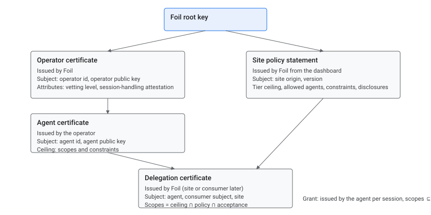
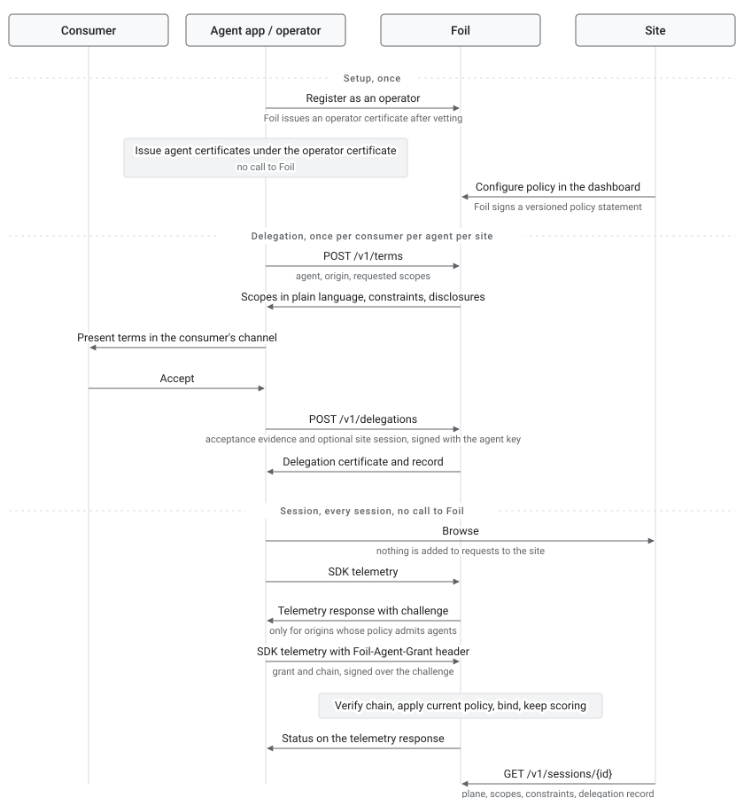

# Agent Admission Protocol

Draft, September 2026.

This document describes how the Agent Admission Protocol (AAP) identifies automated agents, how a site states which agents it admits and what they may do, and how a consumer authorizes an agent to act for them. Foil operates the root of trust and the verification service described here. The document is written for sites that run Foil, for the operators that run cloud browsers for agents, and for the applications that put agents in front of consumers.


## Overview

Sites that run Foil block automated traffic by default. Some of that traffic is an agent doing what a consumer asked, and today a site cannot tell that traffic from credential stuffing, so it blocks both. The Agent Admission Protocol adds a third category between human and bot, called the agent plane, so that a site can admit the automation it has chosen to admit without loosening detection for anything else.

The protocol has three parts. An agent's operator holds a certificate chain that identifies the operator and the agent and states the most the agent may ever do. A site publishes a policy that states which agents it admits, what tier of actions they may perform, and what a consumer must be shown before an agent acts for them. A consumer's acceptance of those terms, collected by the agent's own application, becomes a delegation that authorizes the agent at that site for a limited time. At run time the agent presents a short-lived, self-signed grant that references the delegation, Foil verifies the chain and binds the grant to the browser session, and the site reads the result on the verification call it already makes.

Three properties hold throughout. Foil never presents an interface to a consumer; the agent's application does that, using terms that Foil serves. Nothing is added to any request to a site; credentials travel only between the operator and Foil. A site that has not opted in learns nothing, because an agent never presents credentials to a site that has not asked for them.


## Background


### Agents on your site today

An increasing share of automated traffic comes from agents that act for a specific person. A consumer asks an assistant to check a balance, pay a bill, or connect a bank account, and the assistant drives a browser to do it. The browser usually runs in a cloud environment operated by a company that specializes in running browsers for agents, referred to in this document as an operator. To a site, that session arrives from a datacenter, with an automated fingerprint, and often on a cookie that was created on the consumer's own phone and then moved to the cloud. Each of those facts is also a signature of account takeover, and a site's existing controls are right to treat them that way.


### Why declaration has to be private

The obvious fix is for the agent to announce itself. Existing proposals do this by attaching a signature to every request, so that any site can verify who sent it. Operators have declined to adopt them, because a signature that any site can read is a bot flag that any site can act on, and most sites will block on it. An agent that announces itself everywhere is blocked everywhere. The protocol therefore requires that an agent present its identity only to Foil, and only after Foil has indicated that the site it is visiting admits agents. A site that has not opted in never receives a declaration, on the wire or in a verdict. See [Comparison with Web Bot Auth](#comparison-with-web-bot-auth) for how this differs from request signing.


### Why identity is not enough

Knowing which operator sent a session does not tell a financial institution whether the session is acting for its customer, whether that customer agreed, or what the session may do. Those are authorization questions, and they require a consumer's consent, the site's disclosures, and a scope of permitted actions. The protocol treats identity and authorization as separate links in one chain, so that a site can require both.


## Key concepts


### Planes

Every session at a participating site is assigned to one of three planes. A **human** session is one that Foil scores as human and that carries no declaration. An **agent** session is one that presents a valid grant, is bound to that grant, and remains consistent with the operator that issued it. A **bot** session is everything else, including a declared session that fails any check. A bot becomes an agent by declaring. Detection continues to run on every plane, and a declared session can be moved to the bot plane at any point.


### The chain

The protocol is built from five signed objects. Each is issued by the party that has the authority to make the statement it contains, and each can only narrow the object above it.

| Object | Issued by | States |
| --- | --- | --- |
| Operator certificate | Foil, after vetting | The operator's identity and public key, its vetting level, how it handles transferred sessions, and any attestations about it issued by third parties. |
| Agent certificate | The operator | A named agent's public key and the most it may ever do: a scope ceiling and a constraint ceiling. |
| Policy statement | Foil, from the site's dashboard configuration | Which operators and agents the site admits, the highest tier they may reach, constraints, disclosure bundles, and which delegation issuers each tier accepts. |
| Delegation certificate | Foil in the current version; a site or the consumer in later versions, recorded in the certificate's `issuer` field | That a specific consumer authorized a specific agent at a specific site, with scopes equal to the intersection of the agent's ceiling, the site's policy, and what the consumer accepted, together with the acceptance record. |
| Grant | The agent, per session | A reference to the delegation, the session, the agent's stated intent, and scopes that narrow the delegation. Valid for about an hour. |

The operator certificate and the policy statement are two branches under Foil's root key. They meet at the delegation, which is where the operator's side and the site's side are intersected and signed. The grant hangs below the delegation and is the only object presented at run time.


### Scopes, tiers, and constraints

Permissions are expressed as scopes from a fixed vocabulary, grouped into tiers. Tiers are ordered, so a site's policy is a single ceiling rather than a list. The tiers are observe, read, manage, transact, and control. The control tier contains changes to credentials and recovery contacts and is never grantable. Scopes in the transact tier carry constraints: a per-transaction amount, a total per delegation, a count, whether new payees may be added, and an expiry. Amounts are integers in the minor unit of the constraint's currency, so `20000` with `usd` is two hundred dollars. When two parties state a constraint, the more restrictive value applies. The full vocabulary is listed in the [reference](#reference).

Scopes are a ceiling, not a plan. An agent cannot predict every step of a task, so Foil records which scopes a session actually exercised and reports both the granted and the used set to the site. An agent that needs more scope within its delegation signs a new grant. An agent that needs more scope than its delegation allows must obtain a new delegation.


### Kinds of evidence

A delegation record can carry four kinds of evidence, and the protocol keeps them separate, because they are not equally strong.

Evidence that is **asserted** comes from the agent's application, signed with the agent key: which terms were shown, which acknowledgements the consumer gave, in what channel, and when.

Evidence that is **observed** comes from Foil's own presence on the site: a live session at the site for the same consumer on a device Foil has seen before, scored human, and its age at the time the delegation was created.

Evidence that is **attested** comes from a third party who checked something about the consumer and signed a statement saying so, such as an identity provider confirming an identity document or an application confirming that the consumer controls an email address. It is a statement by an issuer the site has chosen to accept, not proof from the consumer, and it is described in [Attestations](#attestations).

Evidence that is **presented** comes from a verifiable credential the consumer presents from their own wallet, under a key only they hold. It is stronger than an attestation, because the consumer proves possession rather than a third party vouching. It is reserved in the current version and described in [Planned: consumer-held credentials](#planned-consumer-held-credentials).

A site's policy states which kind of evidence each tier requires.


### Attestations

An attestation is a statement about the consumer, signed by an issuer, recorded against a delegation. It exists because some actions need more than the consumer's consent: opening an account may require an identity check, and a payment may require knowing that the consumer controls the email address on file.

The statement is a W3C verifiable credential, serialized as a JWT, signed with the issuer's own key. The subject is the delegation, written as a pseudonymous identifier built from the operator and its own identifier for the end user, so no issuer needs the consumer's identity to write one. Claims are flat values.

Two kinds of issuer can write one, and both produce the same object. An **identity or risk provider** registers with Foil, which holds its public keys, and sites name it in their policy. An **agent application** signs with the agent key it already has, for checks it performed itself, and a site admits those by naming `operator` in its policy, which covers the delegation's own operator and its agents.

A credential reaches the site by one of two paths, whichever suits the parties. An operator that already holds one attaches it when it creates the delegation, so the site needs no exchange with anyone. A provider that would rather deliver its own posts it against the delegation id it was given. Foil verifies the signature against the keys registered for the issuer the credential names, checks the subject, the type, the required claims, and the age against the site's policy, and records an attestation. Only the claims the site's policy names are kept; everything else in the credential is discarded, and the credential itself is not retained.

An attestation stops satisfying a policy when it is revoked by the site or the issuer that signed it, when its validity passes, or when the site changes its policy past what the attestation carries, including removing the issuer from the ones it accepts. Sessions are checked at binding and again at each scope use, so revocation takes effect without waiting for the delegation to expire.

Attestations are optional. A site that requires none is unaffected, and a site that configures which it accepts still requires none until a tier's evidence level says `attested`.

### Disclosures

A site can attach disclosure bundles to its policy, such as an electronic records consent, a privacy notice, or a data-sharing authorization. Each bundle names the documents to present, the acknowledgements the consumer must give, how each document must be rendered, whether a copy must be retained, and which scopes it gates. Foil serves the bundle to the agent's application as part of the terms and records the acceptance in the delegation. A site can mark a bundle as requiring completion on the site itself, in which case an application cannot collect the acceptance and the consumer must complete that step on the site.

### Handoffs

A handoff is a step the consumer must complete on the site from their own device. It is an object with a lifecycle: pending, then completed, canceled, or expired. A session that needs one changes its status to `requires_handoff` and names the handoff in `next_action`, so every party waits on one id until the consumer finishes.

A handoff has a mode. In `approve` mode the consumer approves the action the agent proposed, and the agent then performs it; the session gains an approval carrying the proposed context, and the site checks the agent's submission against it. In `complete` mode the consumer performs the step on the site and the agent resumes afterward. The site chooses the mode per scope in its policy. Identity verification and site-only disclosures are always `complete`, because nothing an agent can propose stands in for the consumer doing them.

An agent asks for a handoff before it acts, supplying the context the scope defines, such as the amount, currency, and payee of a payment. The handoff carries the site's own URL for the step, from a template in the site's policy, a short code for channels where a link cannot be tapped, and a plain-language message assembled by Foil for the application to show. A session that reaches a handoff scope without asking gets a handoff too, with no context and therefore in `complete` mode.

## How it works


### Trust chain



Verification applies one rule at each link: the signature must verify against the key one level up, and the scopes must be a subset of the scopes one level up. The site's current policy is applied again at verification time, so a policy that has been tightened since a delegation was created narrows that delegation immediately. A policy that has been loosened does not widen an existing delegation, because the consumer accepted the narrower set.


### Lifecycle

The lifecycle has three phases with different frequencies. Setup happens once for an operator and once for a site. Delegation happens once for each consumer, agent, and site combination and lasts for the delegation's maximum age. Sessions happen continuously and require no call to Foil.




### Site discovery

A site may publish a public `GET /.well-known/aap` document on their own
origin to advertise protocol/API versions, service endpoints, and optional
capabilities. See [Site discovery](discovery.md) for the format, hosting,
client behavior, and trust boundaries. Discovery locates the service; it does
not grant permission, require attestations, or replace customer consent,
site policy, or the signed challenge. Configured service addresses and
the optional central directory remain supported.

### Where the grant is presented

The Foil SDK on a site's pages sends telemetry to Foil's API hosts. For an origin whose policy admits agents, Foil includes a signed challenge in the telemetry response: a nonce bound to the origin and a short time window. The operator's browser, which controls the network layer beneath the page, verifies the challenge against Foil's root key and, on the next telemetry request, adds a header carrying the grant and the chain, signed over the challenge. The header is injected at the network layer, so page scripts and service workers cannot observe it, and it is sent only to Foil's hosts. Nothing changes in any request to the site.

Because the challenge is signed by Foil and issued only for participating origins, an operator never presents credentials to a site that has not opted in. An optional cached directory of participating origins provides a discovery hint; it does not replace a fresh, origin-bound signed challenge or let an operator skip challenge acquisition.

One grant covers a browser session across origins. When a page embeds a widget from another participating origin in a frame, or opens a participating site in a popup, the same grant is evaluated under each origin's own policy as those frames appear.


### Binding and scoring

When Foil receives a grant, it verifies the chain, checks that the delegation has not been revoked or expired, applies the site's current policy, and binds the grant to the session. Binding means that the grant is now associated with this session's fingerprint and behavior. Foil continues to score the session as it would any other. A grant presented by a session that does not resemble the operator that issued it, a grant presented from a second session, or a session that exercises scopes outside its grant is moved to the bot plane, and the reason is returned to the operator on the next telemetry response.


## Comparison with Web Bot Auth

Web Bot Auth is a draft standard from the IETF in which an automated client signs each HTTP request with a private key, using HTTP Message Signatures, and includes a header that points to a directory where its public key is published. The origin fetches the key, verifies the signature, and decides whether to trust the client, usually by consulting a list of known keys. Several edge providers verify it today, and it is the most widely deployed way for a crawler or a fetcher to identify itself.

The two designs answer different questions. Web Bot Auth establishes which client sent a request. The Agent Admission Protocol establishes which agent is acting, for which consumer, with what authorization, and does so without revealing the agent to any site that has not opted in. The table summarizes the differences that matter to a site deciding what to admit.

| Dimension | Web Bot Auth | Agent Admission Protocol |
| --- | --- | --- |
| Question answered | Which client sent this request. | Which agent is acting, for whom, and with what permissions. |
| Who sees the identity | Every origin, on every signed request. | Foil, and the verdict is shown to sites that have opted in. |
| When identity is presented | Unprompted, on each request. | Only in answer to a challenge signed by Foil. |
| Authorization | None. The origin applies its own rules to a known key. | Tiers, scopes, and constraints, intersected across the operator, the site, and the consumer. |
| Consumer consent | Not represented. | A delegation with the site's disclosures and asserted and observed evidence. |
| Verification | At the origin's edge, per request, against the client's published key. | By Foil at bind, against Foil's root key, with the site's current policy applied. |
| Relationship to detection | Separate. A trusted key is usually exempted from detection. | Detection continues. The grant is bound to a scored session and can be downgraded. |
| Site integration | Fetch keys, verify signatures, maintain a trust list. | A policy in the dashboard and additional fields on the existing verification call. |
| Coverage without a page | Yes. Any HTTP request can be signed. | Not in the current version. The planned edge challenge adds it. |
| Revocation | Rotate the key. | Per delegation, effective at the next telemetry beat. |
| Record for retention | None beyond the origin's logs. | A signed delegation record that can be verified without contacting Foil. |
| Standards status | IETF draft with production deployments. | Built from HTTP Message Signatures, JSON Web Tokens, and trust-chain conventions. Not itself a standard. |


### When each applies

Web Bot Auth is the appropriate mechanism for a crawler, a fetcher, or an API client that has no consumer behind it and that is willing to be identified by every origin it contacts. It is also the only option at a site that does not run Foil. The Agent Admission Protocol is the appropriate mechanism when an agent acts for a consumer, when a site needs to know what the agent is permitted to do and whether the consumer agreed, and when the operator requires that its agents not be identifiable to sites that have not chosen to admit them.


### Using both

The two mechanisms are compatible, and an operator can support both with one key. The agent key in an agent certificate can produce Web Bot Auth signatures. An operator that supports both signs requests to origins that verify Web Bot Auth at their edge and presents its chain to Foil at sites that run Foil. Because a Web Bot Auth signature is visible to the origin, an operator would sign only for origins it has chosen to identify itself to, and the Foil directory of participating origins can serve as that list for sites that have opted in. The planned edge challenge uses the same HTTP Message Signatures format as Web Bot Auth, with the difference that the signature is produced in answer to a challenge rather than on every request.


## Relationship to other work

Several protocols and frameworks address agents, and the protocol is designed to consume their results rather than replace them. The following states the position for each.

| Work | What it provides | How the protocol uses it |
| --- | --- | --- |
| Web Bot Auth | Cryptographic identity of an automated client, presented on each request | The identity link. The same Ed25519 key can be an operator or agent key, agent keys may be published in its key directory, and the planned edge challenge answers in its signature format. |
| Card network agent credentials, including Know-Your-Agent frameworks | Vetting of an agent or operator for payment transactions, recognized across networks | An attestation on the operator certificate, recorded by type, issuer, and reference. Foil vets once and carries the network's credential as evidence. |
| Payment mandates, such as those in the Agent Payments Protocol | A user-signed authorization for a specific payment | The shape of a consumer-signed delegation. A delegation with money-movement scopes can carry or reference a mandate. |
| Model Context Protocol and Agent2Agent | Tool and agent interfaces for the API surface | Surfaces that consume the same scope vocabulary. A site's server can accept the delegation as the credential its tools require. |
| WebMCP | Tools a page exposes to an agent in the browser | The action layer once a session is admitted. Tools can be annotated with scopes so that the SDK exposes only those the session's grant permits. |
| OpenID Connect and AuthZEN work on agent identity and authorization | Identity tokens and policy decisions for agents inside an organization's identity provider | Complementary. An enterprise agent's identity token can be the subject an operator supplies, and a policy decision point can consume the verification response. |

None of these provides a site's policy over a browser session, a credential paired with detection, a consent record that includes the site's disclosures, or evidence that a transferred session was authorized. Those remain the protocol's own.

## Guide for sites


### Before you begin

Your site must already run the Foil SDK on the pages agents will visit and must already call the Foil session verification endpoint from your server. The protocol adds fields to that response and adds a policy to your dashboard. It does not require a new SDK or a new server integration.


### Configure a policy

A policy is configured in the Foil dashboard and takes effect at the next verification. Foil signs the configuration as a versioned policy statement, and the version is recorded on every delegation created under it.

1. **Choose a tier ceiling.** This is the highest tier any agent may reach on your site. Most sites begin with read.
2. **Choose which operators and agents are admitted.** You can admit all vetted operators, specific operators, or specific agents by name. A denied agent is denied without affecting the rest of its operator's agents.
3. **Set constraints for transact scopes,** if your ceiling includes them: the maximum amount per transaction, the maximum total per delegation, the maximum count, and whether payments may go only to existing payees.
4. **Attach disclosure bundles.** Upload the documents, write the acknowledgement text, state how each document must be rendered and whether a copy must be retained, and name the scopes the bundle gates. Mark a bundle as site-only if the acceptance must happen on your site.
5. **Set evidence requirements per tier.** For each tier, choose whether an asserted acceptance is sufficient, whether an observed link to a live session at your site is required, whether an attestation from an issuer you accept is required, or whether the step must be completed on your site by the consumer. The `presented` level, a credential from the consumer's own wallet, is reserved.
6. **Configure handoffs.** For each scope the consumer must complete on your site, choose the mode, `approve` or `complete`, and give the URL of the page on your site that hosts the step, as a template with `{id}` for the handoff id. Identity verification is always a handoff in `complete` mode.
7. **Set the maximum delegation age.** Thirty days is a common value.
8. **Choose what is disclosed to you.** Operator and agent names appear in your verification response only if you enable them. The plane, scopes, and delegation record appear regardless.
9. **Optionally accept attestations.** The policy's `attestations` field names the issuers you accept, the credential types, the claims a credential must carry, and optionally how recently it must have been issued. It is empty by default, and configuring it requires nothing until a tier's evidence level says `attested`.


### Read the verification response

The session verification response gains a status, a next action, and an agent block when the plane is agent. Gate each route on the scopes in the response and compare transaction amounts against the constraints. The full object is described in the [API reference](api.md#sessions).

```
GET /v1/sessions/{id}

"plane": "agent",
"status": "active",
"decision": { "verdict": "allow", "plane": "agent" },
"agent": {
  "id": "ag_9c4e",
  "name": "bill-pay-assistant",          // present only if disclosure is enabled
  "operator": "op_7a1d",                 // present only if disclosure is enabled
  "grant": "g_71c",
  "intent": "Pay September electric bill",
  "scopes": ["accounts:read", "payments:initiate"],
  "scopes_used": ["accounts:read"],
  "constraints": { "currency": "usd", "max_amount": 20000, "payees": "existing_only" },
  "delegation": {
    "id": "dl_1Qx8k2",
    "issuer": "foil",
    "policy_version": 14,
    "created_at": "2026-09-01T14:03:40Z",
    "expires_at": "2026-10-01T14:03:40Z",
    "record": "dr_5e1",
    "asserted": { "terms": "trm_3f2a", "acknowledged": ["esign", "share"], "channel": "imessage" },
    "observed": { "site_session": "sess_2b81", "human": true, "known_device": true, "age_s": 240 },
    "presented": null
  },
  "handoff": null,
  "approvals": []
},
"next_action": null
```

A declared session that failed a check is returned on the bot plane with the reason.

```
"plane": "bot",
"status": "downgraded",
"decision": { "verdict": "block", "plane": "bot" },
"agent": { "grant": "g_71c", "reason": "grant_replayed" }
```

### Handle a handoff

When an agent reaches a scope that your policy marks as requiring the consumer, or asks for confirmation before acting, a handoff is created. The session's status becomes `requires_handoff`, `next_action` names the handoff, and the operator is told on the telemetry response. Your site should treat the agent's attempt as incomplete rather than as an error.

The consumer opens the handoff's URL, which is a page on your site, from their own device. Your page reads the handoff to learn what the agent proposed, renders its own confirmation with your existing step-up controls, and completes the handoff when the consumer confirms. The SDK on that page links the consumer's session to the handoff on its own, so the completion call needs only the id.

```
GET  /v1/handoffs/{id}
POST /v1/handoffs/{id}/complete     { "result": { "confirmed": true } }
```

Foil checks that the completing session is at your origin, was scored human, and is not the agent's session, then returns the agent session to `active`. In `approve` mode the session's agent block gains an approval carrying the context the consumer confirmed, which your server checks the agent's submission against.

### Revoke a delegation

A site can revoke any delegation at its origin. Every grant under that delegation stops being honored at its next telemetry beat, and the operator is notified.

```
POST /v1/delegations/{id}/revoke
```

A consumer revokes through the agent's application, and Foil notifies the operator either way.

### Retain records

The delegation record is available in full, signed by Foil, by expanding the `record` field of the delegation.

```
GET /v1/delegations/{id}?expand[]=record
```

It contains the terms, the document hashes, the acknowledgements, the asserted and observed evidence, the policy version, and the chain to Foil's root key. It can be verified without contacting Foil, so it can be stored in your own compliance system and checked later.

## Guide for operators


### Register

Registration is a vetting process rather than an API call. Foil issues an operator certificate that contains your operator id, your public key, your vetting level, a statement about how you handle transferred sessions, and a list of attestations about you issued by third parties, such as a Know-Your-Agent credential from a card network, each recorded by type, issuer, and reference. The certificate is valid for one year and is renewed through the same process.

Keys are EC P-256, signing with ES256, or Ed25519, signing with EdDSA. Ed25519 is the key type Web Bot Auth uses, so an operator that already signs requests under that scheme can use the same key here, and may publish its agent keys in a Web Bot Auth style key directory.


### Issue agent certificates

You issue a certificate for each agent under your operator certificate, without contacting Foil. The certificate names the agent, carries its public key, and states its ceiling: the scopes and constraints the agent may ever hold. Foil learns of an agent the first time it sees the agent's certificate in a chain. Sites can allow or deny an agent by name, and Foil tracks reputation per agent, so a problem with one agent does not affect the others.

```
{
  "sub": "ag_9c4e",
  "name": "bill-pay-assistant",
  "key": { "kty": "EC", "crv": "P-256", "x": "…", "y": "…" },
  "ceiling": {
    "scopes": ["accounts:read", "transactions:read", "payments:initiate"],
    "constraints": { "currency": "usd", "max_amount": 50000, "payees": "existing_only" }
  },
  "iss": "op_7a1d",
  "nbf": 1756900000,
  "exp": 1764676000
}
```


### Fetch the terms

Before a consumer authorizes an agent at a site, create terms for that agent at that origin. Terms are an object with an id and a one-hour expiry. They contain the scopes the site will allow for this agent, already intersected with the agent's ceiling and the site's policy, each with a plain-language string; the constraints; the maximum delegation age; the evidence rules; and the site's disclosure bundle. The consumer's acceptance references the terms id.

```
POST /v1/terms
{ "agent": "ag_9c4e", "origin": "bank.example", "scopes": ["accounts:read", "payments:initiate"] }

{
  "id": "trm_3f2a",
  "object": "terms",
  "policy_version": 14,
  "scopes": [
    { "id": "accounts:read", "text": "See your accounts and balances" },
    { "id": "payments:initiate", "text": "Make payments up to $200 each to payees you already have" }
  ],
  "constraints": { "currency": "usd", "max_amount": 20000, "payees": "existing_only" },
  "max_age_s": 2592000,
  "evidence": { "read": "asserted", "transact": "observed" },
  "disclosures": {
    "bundle": "linking-v4",
    "presentation": "app",
    "documents": [
      { "id": "esign", "title": "Consent to electronic records",
        "url": "https://cdn.usefoil.com/d/…", "format": "text/markdown", "sha256": "…", "render": "full" },
      { "id": "privacy", "title": "Privacy notice",
        "url": "…", "format": "application/pdf", "sha256": "…", "render": "link" }
    ],
    "acknowledgements": [
      { "id": "esign", "text": "I agree to receive these documents electronically" },
      { "id": "share", "text": "I authorize bill-pay-assistant to access my accounts as described for 30 days" }
    ],
    "retain": "copy_required"
  },
  "expires_at": 1756903600
}
```

### Create a delegation

After the consumer has accepted the terms in the agent's application, post the delegation. The request carries the acceptance and is signed with the agent key. If the consumer is logged in to the site on their own device at the time, include that session's id, which your local component can read from the SDK's telemetry, and Foil records an observed link. The response is the delegation object, with its certificate.

```
POST /v1/delegations
{
  "agent": "ag_9c4e",
  "origin": "bank.example",
  "subject": "usr_41b",
  "scopes": ["accounts:read", "payments:initiate"],
  "terms": "trm_3f2a",
  "intent": "Pay monthly bills",
  "acceptance": {
    "terms": "trm_3f2a",
    "acknowledged": ["esign", "share"],
    "viewed": ["esign", "privacy"],
    "channel": "imessage",
    "accepted_at": "2026-09-01T14:03:40Z",
    "copies_sent_to": "email"
  },
  "site_session": "sess_2b81",
  "signature": "<request signed with the agent key>"
}

{
  "id": "dl_1Qx8k2",
  "object": "delegation",
  "status": "active",
  "scopes": ["accounts:read", "payments:initiate"],
  "constraints": { "currency": "usd", "max_amount": 20000, "payees": "existing_only" },
  "expires_at": 1759492000,
  "record": "dr_5e1",
  "certificate": "<delegation certificate>"
}
```

The `subject` field is your own stable identifier for the end user. Foil does not need to know who the consumer is; it binds the subject to the site's customer through the observed session link or through the site's own step-up.

### Sign and present grants

For each browser session, sign a grant with the agent key. The grant references the delegation, names the session, states the agent's intent, and may narrow the delegation's scopes. Configure your browser to add the grant and its chain as a header on requests to Foil's API hosts, in response to a challenge received on a telemetry response. Inject the header at the network layer so that the page cannot observe it.

```
{
  "iss": "ag_9c4e",
  "delegation": "dl_3c9",
  "session_ref": "sess_19c2",
  "intent": "Pay September electric bill",
  "scopes": ["accounts:read", "payments:initiate"],
  "nonce": "<from the challenge>",
  "jti": "g_71c",
  "iat": 1756900000,
  "exp": 1756903600
}

Foil-Agent-Grant: <grant>;chain=<delegation>,<agent>,<operator>
```

Send the full chain on the first presentation in a session. Foil caches certificates by key id, so later presentations in the same session can carry the grant alone.


### Read feedback

Foil reports on the telemetry response, which your browser already receives. There is no webhook to operate for normal flow.

```
Foil-Agent-Status: bound
Foil-Agent-Status: downgraded; reason=grant_replayed
Foil-Agent-Handoff: required; id=ho_4Kq2m
Foil-Agent-Handoff: completed; id=ho_4Kq2m
```

A site or consumer revoking a delegation is reported on the next telemetry response and is also available as an optional webhook.


## Guide for agent apps

An agent application is the product the consumer interacts with. It may be a chat interface, a messaging integration, a command line tool, or a web application. The application is responsible for showing the consumer what the agent will be allowed to do and for collecting their acceptance, because the consumer is present in the application and in no other part of the system.

The terms endpoint returns everything the consumer must see. Present each scope's plain-language string, each acknowledgement, and each document according to its rendering requirement. A document marked for full rendering must be shown in full; a document marked as a link may be presented as a link. If the bundle requires that a copy be retained, deliver one, for example by email, and record where it was sent. Then record which documents were viewed, which acknowledgements were given, the channel, and the time, and pass that record to your operator to include in the delegation.

The delegation lasts for its maximum age, so a consumer accepts once for each agent at each site rather than once per session. Provide a way for the consumer to see their active delegations and to revoke one.


## Reference


### Scope vocabulary

| Tier | Scope | Covers |
| --- | --- | --- |
| observe | `public:read` | Pages that require no login: rates, locations, product information. |
| read | `accounts:read` | Account list and balances. |
| read | `transactions:read` | Transaction history, including pending items. |
| read | `documents:read` | Statements, tax forms, and other documents. |
| read | `profile:read` | Contact information and settings. |
| manage | `profile:write` | Contact information, alerts, and preferences. |
| manage | `cards:manage` | Lock, unlock, travel notices, and replacements. |
| manage | `disputes:write` | Filing and following up on disputes. |
| manage | `support:write` | Secure messages and appointments. |
| manage | `application:write` | Filling out and submitting an application. |
| manage | `identity:verify` | Identity proofing: document capture, selfie, liveness. Handoff only: an agent can bring the consumer to this step but never complete it. |
| transact | `payments:initiate` | Bill payments and card payments. |
| transact | `transfers:initiate` | Internal, external, and person-to-person transfers. |
| transact | `payees:write` | Adding or editing payees. |
| control | `security:write` | Passwords, multi-factor settings, recovery contacts, and login email or phone. Never grantable. |

Scopes that take a handoff define the context an agent supplies when it asks for one. `payments:initiate` requires `amount`, `currency`, and `payee` and accepts `memo` and `date`; `transfers:initiate` requires `amount` and `currency` and accepts `from`, `to`, and `memo`; `payees:write` requires `payee`; `application:write` and `identity:verify` accept `application`.

### Constraints

| Field | Type | Meaning |
| --- | --- | --- |
| `currency` | string | The three-letter currency of the amounts. |
| `max_amount` | integer | Maximum per transaction, in the minor unit. |
| `max_total` | integer | Maximum total across the delegation, in the minor unit. |
| `max_count` | integer | Maximum number of transactions across the delegation. |
| `payees` | `existing_only` or `any` | Whether new payees may be added. |
| `ttl_s` | integer | Expiry in seconds, applied to the delegation or the grant. |

### Endpoints

The API is resource-oriented and described in full in the [API reference](api.md). The resources and the verbs on them are the following.

| Resource | Verbs | Who |
| --- | --- | --- |
| `agents` | create, retrieve, list, update, deactivate | Operator |
| `policies` | create, retrieve, list | Site |
| `terms` | create, retrieve | Operator |
| `delegations` | create, retrieve, list, revoke | Operator; site for its origins |
| `sessions` | retrieve, list | Site for its origins; operator for its own grants |
| `handoffs` | create, retrieve, list, update, complete, cancel | Operator creates and cancels; site completes |
| `events` | retrieve, list | Either |
| `webhook_endpoints` | create, retrieve, list, update, delete | Either |
| `directory` | list | Operator, optional |
| `/.well-known/foil-root` | | Anyone |

Test mode adds helpers under `/v1/test_helpers/` for consumer sessions, challenges, presentations, scope use, handoff completion, and events.

### Headers

| Header | Direction | Content |
| --- | --- | --- |
| `Foil-Agent-Challenge` | Telemetry response | A Foil-signed nonce bound to the origin and a time window. Present only for origins whose policy admits agents. |
| `Foil-Agent-Grant` | Telemetry request | The grant, signed over the challenge, with the chain on first presentation. |
| `Foil-Agent-Status` | Telemetry response | `bound`, or `downgraded` with a reason. |
| `Foil-Agent-Handoff` | Telemetry response | `required` or `completed`, with the handoff id. |


### Downgrade reasons

| Reason | Meaning |
| --- | --- |
| `chain_invalid` | A signature in the chain did not verify, or a scope was not a subset of the level above. |
| `delegation_revoked` | The delegation was revoked by the site or the consumer. |
| `delegation_expired` | The delegation passed its maximum age. |
| `policy_denied` | The site's current policy does not admit this operator or agent, or the tier is above the ceiling. |
| `grant_replayed` | The grant was presented from more than one session. |
| `operator_mismatch` | The session's fingerprint or network does not resemble the operator that issued the grant. |
| `scope_violation` | The session exercised a scope outside its grant. |
| `evidence_insufficient` | The tier requires observed evidence and the delegation has only asserted evidence. |
| `agent_deactivated` | The operator deactivated the agent. |
| `handoff_completed_by_agent` | A handoff was completed from the agent's own session rather than the consumer's. |


## Security considerations

**Detection continues on the agent plane.** A valid chain establishes who signed what. It does not by itself establish that the session presenting it belongs to that operator. Foil scores fingerprint and behavior on every session and compares them with the operator's known profile, so a stolen agent key produces sessions that are downgraded rather than admitted.

**Grants are bound to one session.** A grant is signed over a challenge tied to an origin and a time window, and Foil binds it to the first session that presents it. A second presentation from a different session is a replay and moves both sessions to the bot plane.

**Transferred sessions become evidence rather than suspicion.** A session that begins on a consumer's phone and continues in a cloud browser looks like cookie theft. When a delegation was created while the consumer's session at the site was live, Foil holds an observed link between the two, and the site can distinguish an authorized transfer from a stolen cookie. A session that moves devices with no delegation behind it is a stronger theft signal than the site had before.

**Sites cannot use participation to trap agents.** An agent presents credentials only in answer to a Foil-signed challenge, and Foil issues challenges only for origins whose policy admits agents. A site that admits agents and then blocks them at the application layer is detectable in its verification usage, and Foil treats that pattern as a breach of participation. This is an enforcement commitment rather than a cryptographic guarantee, and it is stated as such.

**Operators are accountable for what they assert.** Acceptance evidence is signed with the agent key. A false assertion is attributable to the operator and the agent, and reputation is tracked per agent across sites.

**What the protocol does not do.** It does not decide whether a consumer meant to authorize an agent. Tiers, constraints, handoff, and the audit trail limit what a mistaken or coerced authorization can do, and the site remains responsible for consent as it is today. It does not put Foil in the request path between the agent and the site. It does not present anything to a consumer.


## Planned: edge challenge

The current version presents the grant on the SDK's telemetry channel, which requires that the SDK be running on a page. A planned extension lets a site's edge issue the same challenge on HTTP responses, so that an agent can present its chain on the request that follows, before any page loads, and so that requests without a page, such as API calls, can be covered. The challenge and the presentation are the same objects; only the channel differs. On the edge channel the answer is an HTTP Message Signature over the request with the challenge as a covered component, which is the format Web Bot Auth uses, with the grant and chain carried in the same header as on the telemetry channel. An operator that has implemented Web Bot Auth signing reuses it and changes only when it signs. The edge verifies the chain, removes the presentation, and forwards the request to the origin with the plane and scopes. Because the edge has network-level evidence but not yet behavioral evidence, its verdict is provisional until the SDK binds, and the verification response will state which of the two a site is reading.


## Planned: consumer-held credentials

[Attestations](#attestations) cover a credential signed by an issuer and submitted by a business. A credential the consumer holds themselves is stronger, because the consumer proves possession of a key rather than a third party vouching on their behalf, and the protocol reserves three places for it.

First, a presentation is the `presented` evidence level, alongside asserted, observed, and attested. A site can require it per tier in the same setting it uses for the others. It is the evidence that fits onboarding, where there is no prior session to observe and no account to sign in to, and where a consumer holding a government wallet credential can skip a capture step entirely.

Second, the consumer can be the delegation's issuer. The acceptance, with its terms version, acknowledgements, scopes, and expiry, becomes a request the consumer's wallet signs, and the delegation is consumer-signed and Foil-countersigned for the observed facts. The delegation certificate's `issuer` field records this, and is `foil` today. A consumer-signed delegation has the same shape as a payment mandate: a subject, a counterparty, limits, and an expiry, signed by the person's own key. A delegation whose scopes include money movement can carry or reference a payment mandate issued under a payment protocol, so that the site's authorization and the network's authorization describe the same act.

Third, the delegation's subject can be a credential-bound identifier for the site, or selectively disclosed claims the site's policy requests, encrypted to the verifier. The reserved `credentials` field on the policy names the accepted credential types and issuers and the claims that may be requested, separately from the `attestations` field that governs issuer-signed statements.

The presentation happens on the consumer's device, where the acceptance already happens, through the presentation protocol the wallet supports. Foil acts as the registered verifier for every site under it, verifies the issuer signature, the holder binding, and the credential's status, and records the result in the delegation. The operator and the application never see the claims. Grants, challenges, the header, and binding are unchanged.

## Limitations

- The protocol requires the Foil SDK on the pages an agent visits. Requests that do not load a page are not covered until the edge challenge is available.
- Foil is the issuer of delegation certificates in the current version. Site-issued and consumer-issued delegations are designed for but not yet available.
- Attestations are statements by an issuer, submitted by a business. A credential held and presented by the consumer, which is the `presented` evidence level, is reserved and cannot yet be recorded.
- The scope vocabulary is oriented to financial services. Sites in other categories may find it incomplete, and additions are made to the shared vocabulary rather than per site.
- A session driven by a browser's own built-in assistant, on the consumer's own device, is not yet distinguished from a human session.
- Endpoint names, header names, and claim shapes in this document are subject to change before release.


## Glossary

- **Agent.** A named automated actor with a public key and a ceiling, issued a certificate by its operator.
- **Agent app.** The application through which a consumer interacts with an agent and accepts terms.
- **Bind.** The association of a grant with one browser session's fingerprint and behavior.
- **Attestation.** A statement about the consumer, signed by an issuer the site accepts and recorded against a delegation.
- **Ceiling.** The most an agent may ever do, stated in its certificate as scopes and constraints.
- **Delegation.** A consumer's authorization of an agent at a site, with scopes equal to the intersection of the ceiling, the policy, and the consumer's acceptance. Its issuer is Foil today and may be the site or the consumer later.
- **Grant.** A short-lived token signed by the agent for one session, referencing a delegation.
- **Handoff.** A step that the consumer must complete on the site from their own device.
- **Issuer.** A party whose signed statements about a consumer a site accepts: a registered identity or risk provider, or the delegation's own operator and its agents.
- **Operator.** A company that runs browsers for agents and holds an operator certificate issued by Foil.
- **Plane.** The category assigned to a session: human, agent, or bot.
- **Policy.** A site's statement of which agents it admits, what they may do, and what a consumer must be shown.
- **Tier.** An ordered group of scopes: observe, read, manage, transact, control.

